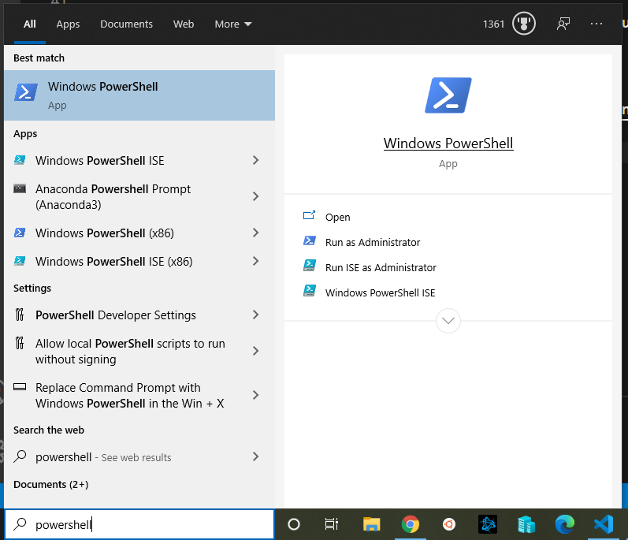
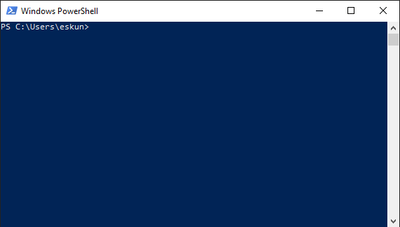
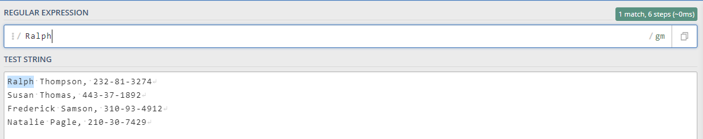
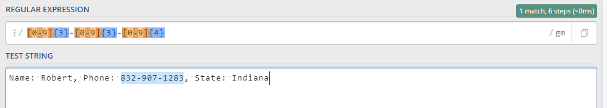

# Welcome to eskunu's Coding Bootcamp!

eskunu is hosting a coding bootcamp to teach others about computer coding using Python. This coding bootcamp is not meant to be a deep dive nor an instructional aid to coding; rather it is meant to cover various high level topics. The bootcamp is tailored to those with minimal or some coding experience and will touch upon a variety of aspects common to computer language.

# Why Code?

Coding is used for applications, such as web design, Discord bots, game addons, (WoW addons are written in LUA, for example), as well as to manage finances, automate Desktop tasks, and write virtual simulations (like in structural engineering, mathematics, chemistry, and so on).

# Why Python?

Python is one of the most popular programming languages available today, has been fully-supported 15+ years and is very feature-rich to perform a variety of tasks. It is highly intuitive, and easy to use and learn compared to other languages.

# What You'll Learn

- Interact with files and folders
- Perform text-search and structured data searches to retrieve specific information from files
- Simple math functions that are useful or required for other more advanced functions
- Interact with websites
- Various coding functions and data structures

# What You'll Build
- Clocks & Calculators
- A File backup application
- Databases
- A price matcher to find the best deals on the internet
- Read text from images (useful for reading signs in pictures, online menus, receipts, and others)

All of the above are *optional* based on the pace and depth you like to learn at.

# Setup & Installation

## Download an Editor

Editors are used to write and edit code. You can use any editor you like (even Notepad.exe) but I highly recommend Visual Studio Code.

Please visit https://code.visualstudio.com/ and download Visual Studio code.

## Download Python

Python is the engine that drives code written in Python. Please visit https://www.python.org/downloads/release/python-387/ and download Python (Python 3.8.7)

 ## Start Powershell

 Start Powershell on Windows by typing "powershell" in the search bar and the "Windows Powershell" app. It's a good idea to create a shortcut to this application in a folder or on your Desktop as we'll be using it frequently.

Once you open Windows Powershell you will receive a prompt that looks like this:
(Note that your exact directory may be a little different)

## Create a Working Directory

Using Windows Explorer or Powershell create a directory to store all of your scripts on the desktop. 

Within Powershell you can create a directory by typing these commands one line at a time: 

        cd C:/Users/<your-username>/Desktop/
        mkdir working-directory
        cd working-directory

# Lessons

## Lesson 1: Pattern Searching

Pattern searching is a way to search for certain variations or combinations of letters, numbers, or any other UTF-8 based character within a body of text. It is highly useful for extracting specific bits of information from an unformatted data source, such as HTML pages or Word documents, and is commonly used in finance, healthcare, cyber security, and accounting, among others. To avoid confusion in the future, we will use the term *regular expression* when talking about this form of pattern searching.

First, visit https://regex101.com/ and copy the body of text below and paste into the *TEST STRING* body on the website.

    Ralph Thompson, 232-81-3274
    Susan Thomas, 443-37-1892
    Frederick Samson, 310-93-4912
    Natalie Pagle, 210-30-7429

### Exercise 1 - Premise:
Search for one of the values in the block of text above, like you would on Google, by typing the string you're searching for in the *REGULAR EXPRESSION* field at the top of the site.

If your search or results are different; don't worry. The important thing to note is that whatever you're searching for, if there is a match, is highlighted in the body below. Also note the number of matches on the right. In this case, there was 1 match.

### Exercise 2 An alphabetic search:
Search for any alphabetic character in the body. This can be done by surrounding your search parameters into square brackets (i.e., `[]`). For example, search for any *lowercase* alphabetic character using this: `[abcdefghijklmnopqrstuvwxyz]`, or more simply, this: `[a-z]`

You can search for both uppercase or lowercase characters using this: `[ABCDEFGHIJKLMNOPQRSTUVWXYSabcdefghijklmnopqrstuvwxyz]`, or this: `[A-Za-z]`, or even more simply, this: `[A-z]`

Note this method is looking for individual characters. To search for an entire string, or sequence of characters, add a plus `+` to the end of the search parameter so that your regular expression looks like this: `[A-z]+`.

You'll notice the search returned words, or in this case first and last names. But how would you search for the first and last name together, with the space in between?

### Exercise 2 Phrase search
To search for grammar structures, simply introduce the grammar or punctuation pattern within the brackets, or create new brackets.

For example, to search for first and last names in this text, all that is needed is to add a space ("`\s`") to the regular expression. This will suffice: `[A-z\s]`

### Exercise 3 

You can also extract numbers and special characters from text by writing this in your regular expression statement: `[1234567890]`, or: `[0-9]`. Searching for `[0-9]+` will return any number between 0 and 9 *until* it reaches another character that is not 0 through 9. For example, if you had the string `Name: Robert, Phone: 832-907-1283, State: Indiana` and you apply the `[0-9]+`, the search will return either just `832`, or `832` and `907` and `1283` individually. Try it out for yourself by copying and pasting the text below into the TEST STRING on regex101.com:

    Name: Robert, Phone: 832-907-1283, State: Indiana

But what if you want the whole phone number intact, including the dashes? There are several methods for getting this information.

* `[-0-9]+` will return any sequence of characters that matches a dash and a number. However, this can be somewhat imprecise for complex or unformatted data structures.
* `[0-9]{3}-[0-9]{3}-[0-9]{4}` will return a sequence of three back-to-back numbers followed by a dash, followed by another sequence of three numbers and another dash, and finally a sequence of four numbers
* There are many more ways of pattern matching on this string that you can try out for yourself on regex101.com

## L: Running Code

To run code in Python you need a Python script and a way to call the script. Let's start with the first by writing several "Print" statements

### Exercise 1

In your editor write the following and save to ex1.py in your working directory:

    print("This is a sentence!")

    print('The "Print" statement is a Python command, telling the Python engine to do something')

    print('In this case, it is telling Python to "Print" everything we put inside the paranthesis back to the console, so you can read it')

    print("Note what happens if we print like this:")

    print()

    print("A new line was created, but nothing else!")

## L: Strings + concatonation
## L: Variables
## L: String concatonation using variables
## L: Math
## L: Types (data types)
## L: Basic Functions

Design a clock
Input: integer
Output: Seconds, Minutes, Hours

